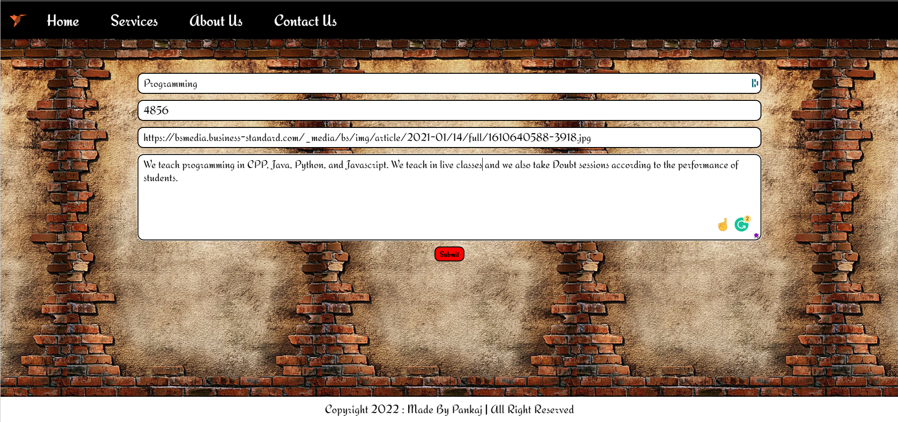

Hi, This is Pankaj, a **MERN Stack Developer**. This is a Freelancing website (A lighter version of an e-commerce website).  
I have created it using with view engine **Pug** for frontend, **Node and Express** for Backend, **MongoDB** for storing data and Deployed on the **Heroku.**
   

> ### Web App Link - https://avyudigital.onrender.com/

 

# Features

- Register as a user
- Login as a user
- Can add services (OBV it must be only for admin but for now it's open for all )
- Contact to admin

# NPM Packages Used

- express
- mongoose
- dotenv
- bcrypt ( to encrypt user password)
- jsonwebtoken ( to create JSON token)
- pug (to use as a view engine)
- cookie-parser (to use cookies)

# Look of Website

- Home page without login 
- Sign-Up Page 
- Sign-In Page 
- Home page After Login 
- Service Page 
- Contact Page 
- ADD Service (As we have already talked that anyone (but must be login) can add a service. So for adding service user must go this URL )

>> ### URL - https://avyudigital.onrender.com/addservice
>>

- Add service page without login 
- Add service page after login 
- After adding service 
  
- When after filling out this service form, you hit the submit button then this service will show on the home page of the website.

## Note

- For more help, You can read help.txt in this repo
- This Project is Version 2 of [Avyu-digital](https://github.com/sainipankaj15/AVYU-DIGITAL).
